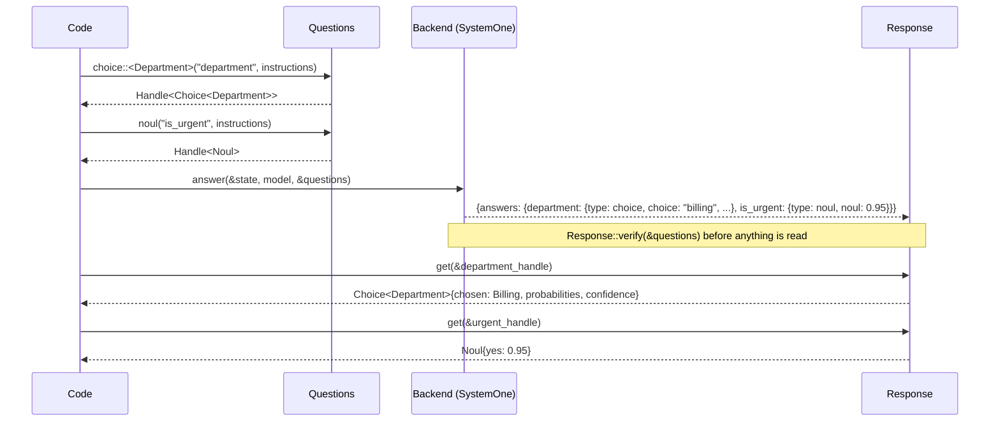
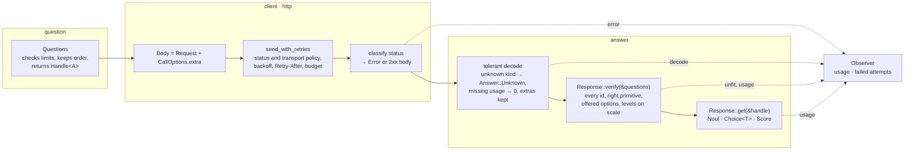
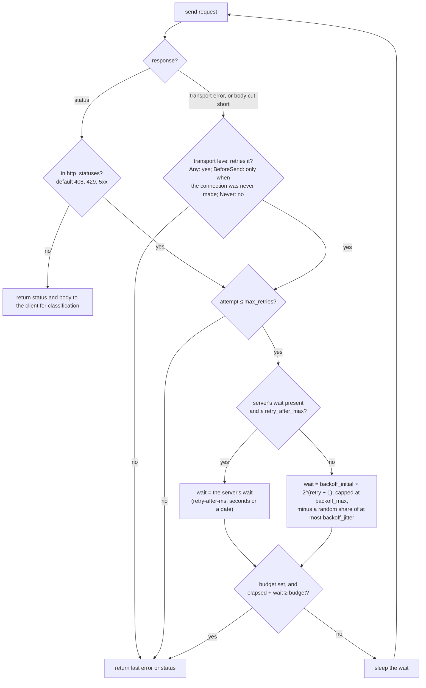

# How judgment works

A System One model answers typed questions about a state, and an application acts on the answers. Four things go wrong between the two: an answer is read as the wrong type, the probability is not one, a transient failure upstream fails a decision a second attempt would have made, and the decision cannot be tested without a key. The crate makes each a property of the types rather than a habit of the caller. The reference for every type, error and default is the rustdoc ([The crate](../reference/crate.md)); this page is the overview it assumes.

## Typed handles

On the wire, questions and answers are two maps keyed by the same ids, and nothing ties a Noul question to a Noul answer. The crate closes that gap at compile time ([decision 0003](../project/decisions/0003-typed-handles-between-questions-and-answers.md)). Adding a question returns a handle that fixes the answer's type. Reading through the handle yields a Rust enum, a probability or a score, or an error naming what did not fit. `dynamic_choice`, for an option set known only at run time, reads as `Choice<String>` so the boundary is visible in the type.

## The response check

A handle checks one answer when it is read. The whole response is checked before anyone reads it: every backend holds the response against the questions it was sent (`Response::verify`). That means:

- an answer for every question,
- of the question's primitive,
- a Choice that names only options it was offered, in its choice and in every key of its distribution,
- a Score whose legend is the levels sent and whose value is on their scale.

A response that does not fit is an error naming the question and the option or level. It carries the server's request id when one was sent. It is not retried, because the call was billed; its token usage is still reported, and the observer counts it as a failed attempt with status `unfit`, beside `decode` for a 2xx body that does not decode. `Fake`, `Replay` and `Recorder` verify too, so a response that reaches the caller answers what was asked whichever backend is behind the `SystemOne` trait. The consequence for an application: an option the model was never offered fails the call instead of being read as a guess.

`Probability` and `Confidence` refuse a value outside `[0, 1]` when they are decoded, and cannot be compared with each other at a threshold. The limits of the HTTP API reference (255 options, 2 to 10 levels, non-empty and unique ids) are checked before sending, so a request that would be refused never costs a call.

## One call, module by module

Behind the `SystemOne` trait the same path runs with a `Fake` (a scripted table), a `Recorder` (another backend, with every response written to a directory) or a `Replay` (a directory of recordings) in place of the client, which is how a decision is tested with no key ([Record, replay and test](../guides/record-replay-and-test.md)).

The decoder is tolerant on purpose: an answer kind this release does not know becomes `Answer::Unknown` (the client logs it at `warn`), a missing `usage` reads as zero, and undocumented top-level fields a compatible server adds are kept in `Response::extra`. A known answer that breaks its shape is still an error. The rules behind each choice are in [Internals](../project/internals.md).

## Retries

A transient failure must not fail a call that a second attempt would have completed, and a persistent one must surface quickly enough for the caller to fall back. The loop in the `http` module sits between those two costs. Its defaults are the official SDKs' ([The crate](../reference/crate.md#defaults)): two retries, a backoff that doubles from half a second to five with a jitter that only ever shortens a wait, 408, 429, every 5xx and every transport failure retried, and the server's wait (`retry-after-ms`, or `Retry-After` in seconds or as an HTTP date measured against the response's `Date` header) honoured on any retried status up to a cap. There is no overall budget unless the caller sets one.

The reasons for each default, and a table of where the crate matches the SDKs and where it deliberately differs, are in the rustdoc of `RetryPolicy`. `RetryPolicy::conservative()` retries only 408, 429 and a connection that was never made, for a caller who would rather fail a billed call than pay for it twice. The loop is public (`judgment::http::send_with_retries`), so another client over `reqwest` in the same application can retry the same way and report to the same observer.

## Errors and the request id

Errors are grouped by what fixes them rather than by status code ([The crate](../reference/crate.md#errors)). A 400 or a 422 is `InvalidRequest` with the server's message and the fields it names as `ValidationIssue`s with dotted paths, plus the server's machine-readable `kind` when the body carries one. A 403 is `PermissionDenied`, apart from a 401, because a new key does not fix it. A malformed API key is `InvalidApiKey` when the client is built, before any request, and no message quotes the key. The client follows no redirect, as the Python SDK follows none: a 3xx is `Error::Http` with that status, because the API never redirects its two paths, and following one would send a gateway header, and on a 307 or 308 the caller's state, to wherever the redirect names.

TypeSafe identifies a call by an `x-typesafe-request-id` response header. It is the one link from a failed call or a surprising answer to the server's own logs, and the client keeps it in four places:

| Where | When |
|---|---|
| `Error::request_id()` | every error that came from an HTTP response, a 2xx whose body does not decode included |
| a ` [request_id …]` suffix on the error's message | the same errors, so a log line that keeps only the message still has it |
| `Response::request_id` | every successful response |
| the `request_id` field of the `typesafe.evaluate` and `typesafe.list_models` spans | every call |

It is the last attempt's id when the call was retried, and there is none after a transport failure. It is optional everywhere, because the published OpenAPI document lists no response headers and a compatible server may not send one ([Laya does not](../project/verification/laya-typed-decisions.md#what-the-two-servers-do-differently)); the hosted API sends it on every 2xx and 4xx ([hosted API](../project/verification/hosted-typesafe.md)).

## What the crate does not do

- **No sync client.** The API documents one evaluation endpoint and a model listing, and every consumer so far is async. A caller that must block can block on the future.
- **No batching or streaming.** The API documents one request shape, and one request already carries many questions.
- **No metrics backend.** A library that named instruments would force its telemetry stack on every consumer. The crate emits `tracing` spans and hands token usage and failed attempts to an `Observer`; the application counts them where it counts everything else.
- **No per-call options across the `SystemOne` trait.** `Client::evaluate_with` takes a `CallOptions` for one call's timeout, retry policy, headers and extra body fields. A recording is filed under a hash of the state and the questions, and an extra field can change the answer, so options could cross the trait only by entering that hash. Keeping them off leaves every existing recording valid.
- **No provider switch.** Any server that speaks the wire is a base URL and nothing more; `SystemOne` is already the abstraction.

## Next

- [Your first decision in Rust](../start/first-decision-rust.md).
- [Record, replay and test](../guides/record-replay-and-test.md).
- [Internals](../project/internals.md), the rules behind the decoder, the error bodies and the recordings, for a contributor.
