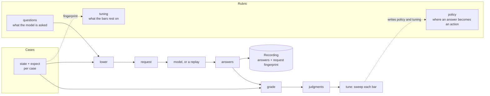

# Rubrics, cases and recordings

A System One request is simple: a state, a model name and a map of typed questions. What is hard to keep is everything around it. The questions live in code; the threshold a probability is acted on at lives in a configuration file or a constant; the labelled examples the threshold was tuned on live in a notebook that no longer runs; the answers the model gave last month live nowhere. When the model version moves, nobody can say which of the four changed, or whether the threshold still holds.

The `.jud` format gives each of them a file with a stated shape, an identity and a fingerprint, so a policy can say which rubric and which cases it was tuned on, a recording can say which request and which server it answers, and two tools can exchange all three without agreeing on anything but the files. [The .jud format](../reference/jud-format.md) is the specification; this page is the reasoning.

## Three documents, one loop

A **rubric** is the decision itself: the questions the model is asked about a state, in the shape the wire sends them, and the policy that says at which probability or confidence an answer becomes an action. The model sees the questions. It never sees the policy. That line through the middle of the file is the most important thing about it: the probabilities are about the state, not about what the application will do with them, which is what makes a bar tunable.

A **cases** document is the examples the decision is checked against: real states, each with the answer a person gave for the questions they were sure of. The cases are never sent to the model. They are what its answers are graded on, and what the rubric's thresholds are tuned from. The person who labels a case is asked what a careful colleague would say with the rubric in front of them; that is the standard the model is held to.

A **recording** is what the model actually answered to one request, kept so a run can be replayed, graded again or compared with a later model's without another call. One rubric, graded on one cases document, produces one recording per case.

## The word

The word *rubric* comes from grading. A rubric is the sheet a grader holds: the questions to answer about a piece of work, and the scale that turns each answer into a mark. Two graders with the same rubric give the same mark for the same work, and a third person can read the rubric and see why. A *case* is one piece of work already marked, the kind a new grader is trained on: where their mark differs, the rubric is unclear or the grader is wrong, and either is worth knowing before the real work starts.

## Identity by content

A rubric's questions, a rubric's policy, a cases document's cases and a request each have a fingerprint: the SHA-256 of their [RFC 8785](https://www.rfc-editor.org/rfc/rfc8785) canonical JSON. Any implementation computes the same fingerprint for the same content, so `tuning.cases: sha256:…` names one exact set of labels whichever tool wrote it, and an edited set is visibly another one.

A rubric has two fingerprints on purpose. The questions' fingerprint is the exact identity of what the model can be asked, unchanged by the name, the description, a label, a comment or the policy. That makes it deliberately not an integrity check of the decision: a gate moved from `confidence: 0.45` to `0.30` leaves it unchanged. So the policy has a fingerprint of its own, and an application that must notice a change to what it does with an answer pins both.

| Changed | Questions' fingerprint | Policy fingerprint |
|---|---|---|
| A question's instructions, an option, a level | moves | unchanged |
| A threshold, a bar, a band, a fallback, a gate's `note` | unchanged | moves |
| The name, the description, labels, annotations, the `tuning` block | unchanged | unchanged |

The request fingerprint, which a recording carries, leaves the model out: the same request answered by `jev-1.13.0` and by a local model has the same fingerprint, and each recording says in `response.model`, `server` and `recorded_at` who answered. The model is the thing a comparison varies.

Every fingerprint is over a value inside `spec`. The envelope, `apiVersion`, `kind` and `metadata`, contributes nothing, so a document renamed, relabelled or moved to a later apiVersion keeps its fingerprints ([decision 0018](../project/decisions/0018-jud-1-3-takes-the-manifest-envelope.md)).

## What each document is not

- **A rubric is not a prompt.** The model receives typed questions with criteria, not free text asking it to decide. A question that says "answer yes only if you are quite sure" has moved the bar into the model, where it cannot be tuned.
- **A rubric is not deterministic logic.** Facts the application has stay in code; the one test the format makes on a state is whether a path is present ([System One](system-one.md)).
- **A case is not an example for the model**, and not what the model said. Copying a recorded answer into `expect` turns a test of the model into a test of nothing.
- **A recording is not a label, not a verdict, and not a cache.** A replay serves what it has and refuses what it lacks, by design: the test that reaches for a missing recording has found a request the suite never saw.
- **Seven cases are not a training set.** They are enough to find a document that is wrong and to show the loop; a threshold tuned on them has an interval wider than the number. The crate reports the interval, and an honest `tuning` block carries the count.

## The loop

1. **Read and bind.** Parse the rubric and the cases; bind the cases to the rubric, so a label that names an option nobody offered, or a question the case's state does not trigger, fails before any call.
2. **Answer.** Lower each case's request and send it, to a server or to a replay of earlier recordings; record what came back with its fingerprint.
3. **Grade.** Grade each response against the case's labels, in the answer's own vocabulary; summarise per question into accuracy with its interval, the Brier score and the calibration error.
4. **Tune.** Sweep each Noul's threshold and read off the best F1; table each Choice's confidence bar against accuracy and coverage and read off the lowest bar that keeps the accuracy wanted; sweep each Score's levels.
5. **Write back.** Put the gates into `policy`, with the cases' fingerprint, the model, the server and the time in `tuning`. The next person to open the file sees what the numbers rest on.

When the model version moves, run step 2 again. The questions do not change, so their fingerprint does not; the bars may, and the policy fingerprint shows it; `tuning` names the new model.

## The metrics

The crate reports per question, from `eval::metrics`:

- **Accuracy with a 95 % Wilson interval** ([Wilson 1927](https://doi.org/10.1080/01621459.1927.10502953)), because an accuracy on three labelled cases and one on three hundred read the same without it.
- **The Brier score** ([Brier 1950](https://doi.org/10.1175/1520-0493(1950)078%3C0001:VOFEIT%3E2.0.CO;2)), in its multi-class form, the sum over the options of the squared difference between the probability and the outcome; the rustdoc states the form because other tools use another and the numbers are not comparable.
- **Expected calibration error** ([Naeini, Cooper and Hauskrecht 2015](https://doi.org/10.1609/aaai.v29i1.9602)) over ten equal-width confidence bins: the gap between how confident the model was and how often it was right.
- **Mean confidence when right and when wrong**, which says whether the confidence separates the two at all.

[Tune thresholds](../guides/tune-thresholds.md) reads them in practice.

## Why one format

[Decision 0014](../project/decisions/0014-a-file-format-for-rubrics-cases-and-recordings.md) weighs the alternatives to one YAML format with content fingerprints; [0016](../project/decisions/0016-jud-takes-minor-versions.md) why a request may depend on the state; [0017](../project/decisions/0017-jud-1-2-refuses-what-a-reviewer-cannot-see.md) why the reader refuses what a reviewer cannot see; [0018](../project/decisions/0018-jud-1-3-takes-the-manifest-envelope.md) why the envelope is a manifest's and the reader reads one apiVersion.

## Next

- [Write a rubric](../guides/write-a-rubric.md), [Label cases](../guides/label-cases.md), [Record, replay and test](../guides/record-replay-and-test.md), [Tune thresholds](../guides/tune-thresholds.md).
- [The .jud format](../reference/jud-format.md), the specification.
