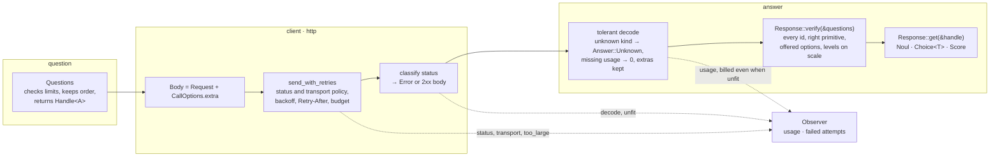
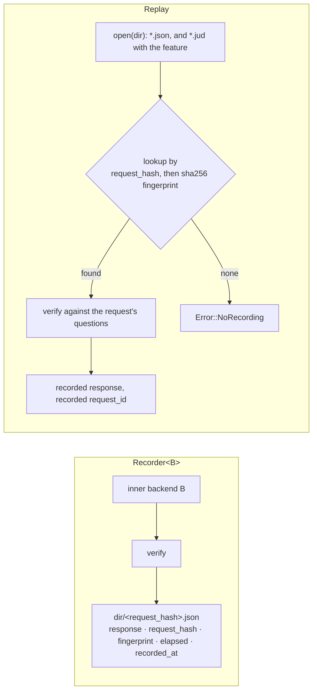
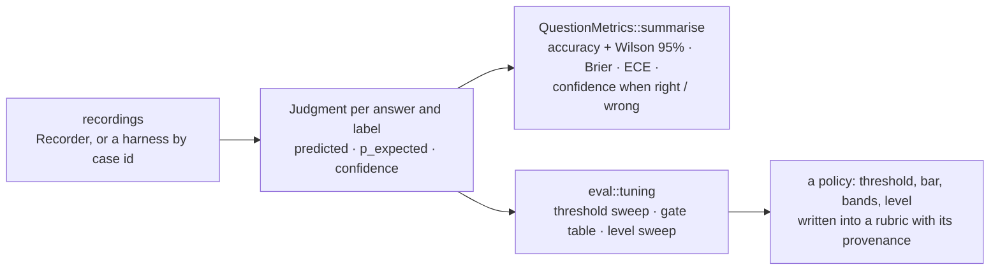
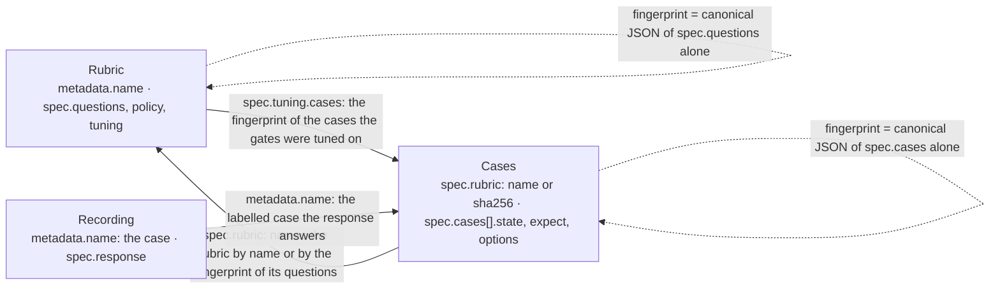

# How the crate is implemented

[How judgment works](design.md) draws the two mechanisms a reader must know before using the crate, the typed handles and the retry loop, and [What is in the crate](tour.md) says what each module promises. This page is the layer under both: the rules the code applies and the reason for each, so a comment in the source can say why in one line and point here for the rest. Where a rule was learnt from a real server, the [verification pages](verification/method.md) record the run; where it mirrors or departs from the official SDKs, the [client libraries survey](research/system-one-client-libraries.md) has the comparison.

## One call, module by module



Every backend behind the `SystemOne` trait ends in the same `verify` step: `Client` after decoding, `Fake` on the table it answers from, `Recorder` on what it records, `Replay` on what it reads back. The consequence is the one guarantee the crate adds to the wire: a response a caller holds answers the questions it sent, or the call failed.

## Building the request

The builder refuses before sending what the HTTP API reference page says the server refuses: more than 255 options on a Choice, fewer than 2 or more than 10 levels on a Score, an empty or duplicate question id, an empty option key, a `null` level. Those bounds are stricter than the OpenAPI document, which bounds neither above; the [hosted API record](verification/hosted-typesafe.md) says which bound is the server's and which the crate's own. Questions and a Choice's options keep insertion order because it is the order the model sees, and a sorted map would send them alphabetically.

## The client

**Defaults** are the official SDKs': the key from `TYPESAFE_API_KEY`, `https://api.typesafe.ai`, `jev-latest`, 10 s per attempt, two retries. The user agent is `judgment/<version>` so the API's logs tell this client from the SDKs and from the embedding application.

**The key is checked at build time, with the Python SDK's rules.** Trimming uses what Python's `str.isspace` accepts, which is Rust's `char::is_whitespace` plus the information separators U+001C to U+001F; a byte-order mark is not whitespace to Python and is refused, not trimmed. Blank is `MissingApiKey`; inner whitespace, a control character, a non-ASCII character or a `TYPESAFE_API_KEY` that is not valid UTF-8 is `InvalidApiKey`. A key passed to the builder is used or refused as it stands and never replaced by the environment's, because silently authenticating with another key bills or authorises the wrong account. No message quotes any part of a key. The key is checked before the base URL, both before any default header, all before a request.

**No redirect is followed.** `reqwest` strips `authorization` on a cross-origin redirect but not a header set with `default_header` or a per-call header, so a gateway credential would reach whatever `Location` named, over plain HTTP if it said so, and a 307 or 308 would re-send the state. The API never redirects its two paths, so a 3xx means the base URL is wrong, and that is a base URL to change rather than a policy to offer.

**Status to error.** The table is the whole classification; the retry column is the default policy's.

| Status | Error | Retried | Why |
|---|---|---|---|
| 400, 413, 422 | `InvalidRequest`, `status` tells them apart | no | a retry cannot fix a body |
| 401 | `Unauthorized` | no | a new key fixes it |
| 403 | `PermissionDenied` | no | a new key does not; the account's access does |
| 408 | `Http` once retries stop | yes | transient by definition |
| 429 | `RateLimited`, with the server's wait | yes | the account's rate limit |
| 529 | `Overloaded` | yes (not under `conservative`) | TypeSafe's capacity |
| other 5xx | `Http` once retries stop | yes | transient by definition |
| 3xx, 404, anything else | `Http` | no | a base URL that is not the API, or a server without the path; the body says which |
| 2xx that does not decode | `Decode`, reported as `decode` | never | the loop counted the 2xx as a success, so the client must report the failure itself |
| 2xx that fails `verify` | an answer-fit error, reported as `unfit` | never | the call was billed, so its usage is reported first |

**Reading a 400, 403 or 422 body** follows the Python SDK's order: the message is the first non-empty string of `error`, `error.message`, `message`, `detail` as a string, `detail.message`; then the issues of a `detail` list joined as `path: msg; …`; then the code; then the raw body, truncated to 2,000 bytes. The code is the first non-empty string of `detail.error_type`, `error.type`, `error_type`, `type`, and is kept as `InvalidRequest::kind` because the hosted API sometimes sends a code and nothing else (`max_tokens_exceeded`). The three shapes the hosted API uses, none of them in the OpenAPI document, are in the [hosted API record](verification/hosted-typesafe.md). Where the crate departs from the SDK on purpose: an empty string does not win over the next field; only a leading `body` location segment is dropped, since dropping every one would hide a question whose id is `body`; a non-JSON body is quoted truncated rather than kept whole. A validation issue's `input` and `ctx` are never read because `input` can echo a piece of the state.

**The request id** (`x-typesafe-request-id`) is read in the client, not in the shared loop, so the loop carries no vendor's header name. It is the last attempt's, there is none after a transport failure, and a value that is empty, not printable ASCII or longer than 256 bytes is ignored, so what reaches a span or an error message is bounded. The body's `request_id` key, if a server sends one, is overwritten by the header: the field means the header.

**Per-call options** exist because one client serves calls that want different things, and a client per combination would duplicate the pool and the key checks. Precedence, lowest first: the builder's settings and default headers, the call's options, then what the client owns, which is refused rather than overridden. Refused headers: `authorization`, `content-type`, `user-agent` and `x-typesafe-retry-count` (the client's own; the last is not sent yet, but both SDKs strip a caller's value, so reserving it now means sending it later breaks nobody), and `content-length`, `transfer-encoding`, `host`, `connection`, `te`, `upgrade`, which the HTTP stack would keep over its own and which truncate or reframe the body or send the key to another virtual host. Refused body fields: `state`, `model`, `questions`, matched exactly, because a replaced `questions` sends a request the response is not verified against and a recording is not filed under, and a replaced `model` makes the span lie. The SDKs silently keep their own headers and let `extra_body` replace `questions`. A call's timeout replaces the client's, keeping one deadline per attempt; a call's retry policy replaces the whole policy, as in the Python SDK; a budget stops a retry whose wait would end past it but never cuts an attempt in flight. Without options a call sends byte for byte what it sent before options existed, which a unit test pins.

**Options stop at the `SystemOne` trait.** A recording is filed under a hash of the state and the questions, and an extra field can change an answer; if options ever cross the trait they must enter that hash, with an empty set hashing as today, or a replay would answer a different request.

## The retry loop

[How judgment works](design.md#retries) draws the loop and lists the defaults. The rules the code applies around them:

- **A 2xx is never retried**, even when its status is listed in the policy: the call succeeded and was billed. The JS SDK returns on `res.ok` before reading its set; the Python SDK retries only a raised error.
- **Transport failures** are retried by default. `TransportRetry` is one three-level setting rather than the SDKs' two flags because the flags split failures by kind, which does not answer whether the request left the process. `BeforeSend` retries only when `reqwest` reports the connection was never made; a connect or TLS handshake that hangs until the per-attempt timeout ends as a timeout and is not retried under it. A misclassification can only retry less, never retry a request that was sent.
- **`conservative()`** retries 408, 429 and connections never made, because the API reference says a billed call's tokens are billable and does not say whether a 5xx or a timed-out call was charged; 529 is excluded because nothing says an overloaded server refused the request before processing it.
- **The jitter is one-sided**, `backoff × (1 − U·j)`, so the nominal backoff is also the longest wait; at 0 clients that failed together retry in lockstep. A jitter above 1 reads as 1, a negative or NaN one as 0, rather than being refused. The code never uses `Duration::mul_f64`, which panics at `Duration::MAX`.
- **The server's wait** is read as `retry-after-ms` first (a convention of the OpenAI and Anthropic SDKs that both TypeSafe SDKs follow), then `Retry-After` in seconds, then as an HTTP date in the three RFC 9110 forms, measured against the response's own `Date` header when it has one so a skewed local clock neither stretches nor cuts the wait. It replaces the backoff with no jitter, on any retried status, up to `retry_after_max` (30 s; the JS SDK caps at 60 s, the Python SDK not at all), above which the client's own backoff applies so a hostile header cannot stall a caller. A value that is empty, negative, not finite or too large for a `Duration` is ignored and the next source decides. `retry_after_max` of zero is the crate's spelling of the SDKs' `respect_retry_after: false`.
- **The budget** counts from the first send and stops a retry whose wait would end at or past it, returning the last failure: tenacity's `stop_before_delay`, which the Python SDK uses. It never cuts an attempt in flight; a hard deadline is `tokio::time::timeout` around the call. It is off by default because the attempt count and the per-attempt timeout already bound a call, the JS SDK has none, and a default would change the timing of every client sharing the loop.
- **The body cap** (8 MiB, no SDK equivalent) fails on a `Content-Length` above it before a byte is read, and reads a body without one chunk by chunk until it would pass; a body over the cap is never retried, since the next attempt would carry the same body.
- **Every failed attempt is reported** to the global observer from the loop, retried or not, under the status, `transport` or `too_large`; the loop is the one place every client passes through.
- **The loop names no vendor's header.** It returns the last response's headers for each client to read its own; retried responses are dropped with theirs. `make` is called once per attempt so each attempt is a fresh request; dropping the future cancels the call, a wait included.
- **Not taken from the SDKs**: exception and predicate hooks, because a closure field would cost the policy its `PartialEq` and `Debug`; the `X-TypeSafe-Retry-Count` header, not sent but reserved.

The bounded Kani proofs over the delay computation and their bounds are in [Testing without the model](testing.md).

## The backends

`SystemOne` takes the state as a `serde_json::Value` rather than a generic `Serialize` so the trait can be a trait object; the cost is one boxed future and one conversion per call, small next to a round trip. Per-call options do not cross it.



**`Fake`** answers from a table keyed by question id and verifies like the client, so a question with no scripted answer, a Choice option the question does not offer or a Score off its scale fails the call, and a refused call is not counted in `calls()`. A scripted Score's legend is filled in at answer time from the question it answers, so the echo the check sees is the one a server would send; its value is the probability-weighted position, and fewer probabilities than levels read as zero for the rest.

**`Recorder`** verifies the inner response before writing anything, so a recording is only ever a response a replay can return; the file is keyed by `request_hash`, FNV-1a over canonical key-sorted JSON of the state and the questions, because the standard library's hasher promises no stability between Rust versions and a directory of recordings needs no adversary resistance. The same state and questions find the recording whatever order keys were inserted in and whatever model alias was asked for, and a changed question misses it instead of grading old answers under new questions. The `sha256:` RFC 8785 fingerprint is written beside it as the key other tools compute.

**`Replay`** reads only the regular files of its directory, never a symlink or a subdirectory, and looks a request up by its SHA-256 fingerprint first and by the FNV hash second, because the fingerprint is the published key and FNV can be collided on purpose; both cover the questions, so a recording found by either was made for them. Each recording is verified against the questions of the request that found it, so one edited by hand or made by an older release fails naming the question rather than replaying an answer the client would refuse. A replayed response carries the recorded call's request id, not a new one. A recording that carries neither key, a harness's keyed by case id alone, is skipped; a later recording of the same request replaces an earlier one.

## Decoding tolerantly

A response is decoded whole, so one answer of a kind this release does not know, or a server that reports no `usage`, would lose every answer in the response, and each addition by TypeSafe or a compatible server would be an outage until the crate was upgraded. The decoder therefore tolerates exactly three things and nothing else:

- an answer whose `type` is a string the crate does not know becomes `Answer::Unknown`, logged once at `warn` by the client;
- an absent or `null` `usage`, or count inside it, reads as zero, which every consumer of the numbers (a counter, a sum) leaves right;
- top-level fields other than `model`, `answers`, `usage` and `request_id` go to `Response::extra` and come back out on write, so a recording keeps a compatible server's `routing` and a response without extras serialises as it did before the field existed.

A known kind that breaks its own shape (a Noul of 1.2, a Choice without `probabilities`), a `type` that is missing or not a string, a negative or fractional count, a missing `model` or `answers`: all `Decode`. `Answer`'s `Deserialize` is written by hand, buffering into a `serde_json::Value` and dispatching on `type`, because a derived `#[serde(untagged)]` fallback would catch every answer the tagged variants refuse, so a Noul of 1.2 would decode as `Unknown` and the remedy that suggests, upgrade the crate, would be wrong. `KnownAnswer` mirrors `Answer` field for field and the conversion names every field, so a field added to one and not the other does not compile. Duplicate keys in an answer object: the last wins, `type` included, as every JSON object read into a map behaves; RFC 8259 leaves the case undefined and a server that sends them has no one answer to read.

Every server-chosen string that can reach a message, a log line, a span event or a graded judgment goes through one bound: escaped with `str::escape_debug` and cut to 64 characters. An unknown kind, an answer key nobody asked for, an off-list option in a message, a probability key in a Score error. The error's own field keeps the whole string for code that compares it. The guard is against a line break or an unbounded string in a log line or an exported span.

```mermaid
flowchart TD
    A["answer object"] --> T{"`type`?"}
    T -->|"missing or not a string"| E1[Decode error]
    T -->|"noul · choice · score"| K["KnownAnswer, strict derive"]
    K -->|"shape holds"| OK["Answer::Noul / Choice / Score"]
    K -->|"shape broken"| E2["Decode error: the server is wrong,<br/>not the crate out of date"]
    T -->|"any other string"| U["Answer::Unknown<br/>kept under an unasked id,<br/>AnswerTypeMismatch under an asked one"]
```

## Checking the response

`Response::verify` walks the questions in id order, stops at the first failure, is pure, and is public for a response that did not come through a backend (one read by case id from a recording, one decoded by a caller's own transport). What it checks is on the design page; what it deliberately leaves unchecked matters as much:

- **Distribution sums.** 0.97 or 1.0002 is rounding, and the API promises no tolerance to check against.
- **An offered option missing from a Choice's distribution.** It reads as zero through `Choice::probability_of`, as if the server had sent zero. The check is for keys the question never offered.
- **Which option is chosen.** The wire's `choice` is the most probable one, but ties and rounding make the argmax a poor check.
- **Whether a Score's value is the expectation of its distribution.** The server rounds both: a recorded Jev answer reports 2.23 where its rounded probabilities give 2.22.
- **Answers under ids nobody asked, `extra`, the model name, the usage.**

A Score's scale: the legend has exactly one entry per level keyed `"0"` to `"n-1"`; probability keys must be exactly those decimal indices (`"01"` and `"+1"` parse as 1 and are refused); the value must lie within `0..=n-1` with a private margin of 1e-9 for float error, so 3.001 on a four-level scale is refused rather than snapped. A structured level (an object or an array) is echoed as the value by the hosted API and as the JSON text shown to the model by `laya-serve` 0.3.22 and later; `verify` accepts a string level only as its exact string, never parsed, and a structured level as the same JSON value or a string that parses to it, so spacing and key order do not matter but `1.0` for `1` does. `Score::levels` labels a structured level by its compact JSON whichever way it came, so a log line reads the same from every server. Messages from the scale check never quote a level's text, which is the caller's own question and can be long.

The level nearest to a Score value is the value rounded half away from zero and clamped to the scale, 0 for NaN; `Score::nearest_level` and the level sweep in `eval::tuning` share the function, and a bounded Kani proof shows it is always an index of the scale ([Testing without the model](testing.md)).

The documented confidence formulas, a Choice's `(p_max − 1/n) / (1 − 1/n)` and a Score's `1 − spread / even_spread`, are implemented as `confidence_from_probabilities` so a caller can see when a server defines confidence otherwise (Laya reports one minus normalised entropy). `verify` does not check them: they are documentation, not the schema.

## Errors

The variants are grouped by remedy; the table above gives the mapping from a status. Beyond it:

- **`is_unfit`** is true for `MissingAnswer`, `AnswerTypeMismatch`, `UnknownOption` and `InvalidAnswer`: the call went through and its answer cannot be used. An evaluation harness records such a case as failed, with the request id, and carries on, where any other error stops the run. It is false for `Decode`, which is not an answer at all.
- **`is_request_too_large`** is true for a 413, or a 400 whose kind is `max_tokens_exceeded`: the one refused body a caller fixes by sending less, state first, rather than by fixing a question. TypeSafe's own guidance is that accuracy falls as the state grows with unrelated content well before the budget does.
- **A `ValidationIssue`** is an entry of the OpenAPI document's `HTTPValidationError` list. Its path runs `questions.<id>.<type>.<field>` because FastAPI puts the tag of the question's discriminated union in the location; an integer segment is kept as its decimal string so an array index and a numeric map key read the same.
- **The request id suffix** ` [request_id …]` is appended to a message only when there is an id, so a message without one reads as it did before ids were carried; the four answer-fit errors get theirs from `Response::get`, because the typed views read an answer without its response.
- **`Transport` and `ResponseTooLarge` never carry an id**: no response came back, or the loop dropped it unread with its headers, as the SDKs do.

## The observer

Token usage goes to the client's own observer when one was set on the builder and to the global one otherwise, the way `tracing` falls back to its global subscriber. Failed attempts always go to the global observer, because the retry loop is shared with clients that carry no observer and has no client to ask. `set_global` is first-call-wins, so an application installs it once at start-up and a library never overrides it. Retried attempts are reported too: a retried failure is still load on the upstream and still a symptom. Statuses reported: an HTTP status, `transport`, `too_large`, and from the client `decode` and `unfit`; an unfit response's usage is also reported, since it was billed.

## The contract document

`contract::OPENAPI_DOCUMENT` (feature `openapi`) is the vendored TypeSafe OpenAPI 3.1.0 document, API version 0.2.0, about 25 KB, written canonically (sorted keys, final newline) by `tests/openapi_drift.rs` so a refresh diffs cleanly. It sits behind a feature because a client has no run-time use for the text; `tests/contract.rs` checks the crate against it on every run ([How the crate is checked](verification/method.md)).

## Recordings and evaluation



**Keys.** A recording's `case` must be a name before `write_recording` or `read_recording` touches the file system, so an id from a document never joins a directory as a path. `request_hash` is FNV-1a 64 over a near-canonical rendering of the state and the questions, keys sorted at every level, no whitespace, numbers as `serde_json` prints them, sixteen hex digits. It names recording files, so it must not move between runs, machines or toolchains, which the standard library's hasher does not promise. It stays as it is because it names the committed recordings; the `sha256:` RFC 8785 fingerprint beside it is what a new tool computes, with the model left out so the same request answered by two models yields two recordings under one name. A recording also carries the server's base URL, because two servers speaking the same wire answer differently, and an RFC 3339 timestamp, because an alias such as `jev-latest` moves. The timestamp is computed without a date dependency, through Howard Hinnant's civil-from-days algorithm.

**Grading.** A Noul is `yes` at a probability of 0.5 or more, with `max(p, 1 − p)` standing in for the confidence the wire does not send; a Choice is graded by its option keys and a Score by its level indices as strings, the most probable level predicted. An `Answer::Unknown` is graded as a miss rather than dropped, because dropping it would raise the accuracy of a model whose answers could not be read: it predicts `<kind>`, which no option key equals, with probability zero on the label and confidence zero, so it lowers accuracy and costs a Brier of 1.0 while its calibration pair pulls the calibration error toward zero. The case is rare and loud: only a response that bypassed `verify` can bring one. A label outside the option set adds the missing `(1 − 0)²` term to that judgment's Brier, so it hurts rather than vanishes; unlabelled judgments count in nothing.

**Metrics and their definitions.** The Brier score is the multi-class sum `Σ_i (p_i − y_i)²` against the one-hot truth, 0 perfect and 2 full confidence in the wrong option (Brier 1950); other tools halve it or report the binary form, so figures are not comparable without the definition. The expected calibration error uses ten equal-width bins over the clamped confidence, `Σ_b (n_b / n) · |mean confidence_b − accuracy_b|` over the non-empty bins (Naeini, Cooper and Hauskrecht 2015). The accuracy interval is Wilson's (1927), chosen over the normal approximation because it stays inside `[0, 1]` and does not collapse to a point at 0 of 3 or 3 of 3; it assumes independent observations, so related variants of one input make it optimistic. Percentiles are nearest-rank. Bounded Kani proofs cover the bin index and the rank ([Testing without the model](testing.md)).

**Tuning.** A threshold is a property of the model, the questions and the data together and moves when any of the three does, so it is read off a table and the rule that picks from the table is printed with the result. The threshold sweep steps 0.05 to 0.95, predicts yes at `p_yes ≥ threshold`, and `best_threshold` takes the best F1 with ties to the lowest threshold, because a lower threshold says yes more often and a tie means the extra yeses cost nothing. The gate table steps a confidence bar from 0, the baseline that acts on everything, to 0.95, reporting coverage and the accuracy among the covered; `lowest_bar` takes the lowest bar reaching a target accuracy over a minimum of covered judgments, lowest because every step up hands more work to a person. A rubric's bands are bars read off the same rows. The level sweep reads a Score the way a rubric gate does, by the nearest level to the probability-weighted position rather than the most probable level, which differ on a spread distribution; recomputed from the probabilities, it can round apart from the wire's rounded `score` at a boundary.

## The `.jud` reader (feature `jud`)

[The .jud format](jud.md) is the specification; this is how the reader applies it.



**Reading.** YAML is read with `serde_saphyr` under five options: `strict_booleans`, which keeps `yes`, `no`, `on` and `off` as strings; `merge_keys = Error` and `reject_unsupported_tags`, which refuse what folds in or decodes text the reviewer did not see; `ignore_binary_tag_for_string`, which keeps a `!!binary` scalar as its text; and `with_snippet = false`, so an error names a line and a column and quotes no part of a document whose state may be someone's data. Duplicate keys are the parser's own error. The envelope is checked first: a missing `apiVersion` or `kind` is `Missing`; an `apiVersion` that is not the string `jud/v1.3` (another string, or a number) is `Version`, naming what was found; a `kind` outside the three is `Kind`. Every kind is read through a raw struct whose keys beyond the four of the envelope are collected, and the first is refused by name, pointing at `metadata.annotations` as the place for a tool's own data. `metadata` is one struct for every kind, read with no unknown field; a kind then refuses by path the optional fields it does not take (`version` on a Cases document or a Recording, `description` on a Recording), and `labels` and `annotations` are maps of string to string kept in document order, part of no fingerprint. Every `metadata.name` and every case `id` is checked against the name grammar (`eval::is_name`) before anything else about it is read. A Recording's `spec` is read as the `eval::Recording` struct with `metadata.name` inserted as its `case`, and a `spec.case` is refused because the case has one place. A Noul's criteria keys read through an untagged `Bool | Text` so a bare `true:` and a quoted `"true":` both land on the yes criterion. A parsed question runs through the same validation as the builder's, with a minimum of zero options when `options_from: request` and two otherwise, which is how a Choice that takes its options from the request may list fewer than two.

**One apiVersion.** The reader reads `jud::API_VERSION` and nothing else, and the writer writes it: `apiVersion`, `kind`, `metadata` (`name`, then `version`, `description`, `labels` and `annotations` when present) and `spec`, in that order. Nothing is computed from a document's content to choose a version, there is no table of which field belongs to which version, and no envelope other than this one is read or converted; a document of another apiVersion is refused by name before its body is looked at. "A declaration counts by its presence" is one deserializer: a present key is `Some` whatever its value (`part_when: {}` and `strict: false` included), an absent one `None`, and `null` is refused with a message saying to leave the field out, read through a JSON value first because a YAML reader may otherwise take `null` for an empty map. `bands: []` is refused before any other gate check, because an empty list would read as no bands.

**Why a rubric's fingerprint is its lowered request's.** A rubric question serialises as the bare wire `Question` first and adds `when`, `part_when` and `options_from` only when set, so a question without declarations is byte for byte a `Question`, and the fingerprint of a rubric's questions equals the fingerprint of the `Questions` it lowers to. Declarations are part of the identity; the envelope (`metadata`, with its name, version, description, labels and annotations) and `policy` are not, which is why moving every identity field into `metadata` moved no fingerprint. A case's fingerprint covers `options`, `tags` and `note` as well as `state` and `expect`, with empty fields skipped, so adding an empty `tags` changes nothing.

**Lowering** checks the supplied options first, before any question: an id the rubric lacks, a question whose options do not come from the request, and a supplied key the static criteria already offer are each refused. Then, per question in rubric order: skip when `when` is not present; drop each instruction part whose `part_when` path is not present, and set the instructions to `null` when every part went; for a Choice with `options_from: request`, offer the supplied options in supplied order followed by the static ones; then add through the builder, whose refusal becomes a question error. `lower` and `to_yaml` re-run the checks `parse` ran, because the rubric's fields are public and a rubric built in code may never have been parsed; what is written must read back. The order of options on the wire is witnessed by byte position in the serialised request, not by comparing JSON values, because `serde_json::to_value` sorts object keys while the client streams the request in insertion order.

**Applying** requires a request this rubric lowered: an id the rubric lacks or whose primitive differs is refused, the response is verified against the request, and a missing answer is the crate's `MissingAnswer`. A gate becomes bars in one place: with `bands`, one bar per band in document order; with `confidence` only, one bar with no verdict; with neither, no bar, so nothing is deferred whether or not `strict` is set. A bar is met with `>` when strict and `>=` otherwise, for the Noul threshold and every confidence bar alike. A Score's verdict uses the nearest level to the probability-weighted position, not the most probable level. A level label resolves first as an index and then by exact text, which is the level's string or the compact JSON of a structured level, the same text `Score::levels` reports; a level whose own text is a decimal is therefore shadowed by the index.

**Cases.** A case's request is exactly the rubric lowered for its state with its supplied options, and both binding and grading go through it. Supplied options are shape-checked at parse time without a rubric: a non-empty key and a description that is text, an object, an array or `null`. `{from_turn: n}` keeps its key required even when `null`, so `{}` is not a label. A label is produced in the judgment vocabulary: `yes` or `no` for a Noul, where `{from_turn: n}` is yes when the turn exists; the option key for a Choice, checked against the lowered request so supplied options count; the level index as a string for a Score. `per_turn` resolves `from_turn` at each turn, keeps every other label only at the last turn, carries `id`, `options`, `tags` and `note` onto every turn, and returns nothing for a state that is not an array. `grade` returns one judgment per labelled question in the case's `expect` order.
