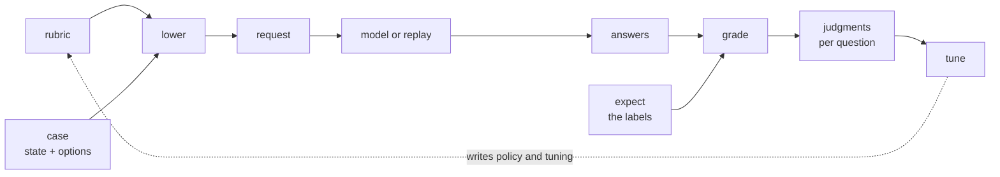

# What cases are

A cases document is the labelled examples a decision is graded on. Each case is one state the rubric's questions are asked about, with the answer a person gave for the questions they were sure of. It is the second kind of `.jud` document: [a rubric](rubric.md) says what the model is asked and where the line is drawn, cases say what the right answers are for a handful of real states, and [recordings](recording.md) say what the model actually answered. The specification is [the .jud format](../jud.md#cases); this page is the reasoning.

## The word

A case is one piece of work the grader has already marked. When a new grader is trained, they are given marked work and asked to mark it again; where they differ, the rubric is unclear or the grader is wrong, and either is worth knowing before the real work starts. A cases document is that marked work: states with the marks a person gave, so a model's marks can be compared with them.

The person who labels a case is not asked to guess what the model will say. They are asked what a careful colleague would say, with the rubric in front of them. That is the standard the model is held to, and the only one a threshold can be tuned against.

## The problem cases solve

A threshold is a claim about a model's probabilities: that above this number, the model is right often enough to act on. Nothing in the rubric can justify that number. It takes examples where the right answer is known, the model's answer on each, and a count of how often the two agree at every candidate bar.

Those examples tend to live where they were last needed: a notebook that no longer runs, a spreadsheet one person keeps, a test file whose expected values were copied from the model's own output. The labels drift from the questions when the questions change, nobody can say which examples a threshold was tuned on, and when the model version moves, the examples cannot be rerun because the request they stood for is gone.

A cases document keeps the examples beside the rubric, in a shape a program can run and a reviewer can read. Each case carries the state the application would actually send, so a case is a complete request once the rubric is known. Each label is written in the answer's own vocabulary, so grading needs no translation. The document has a fingerprint, so a rubric's `tuning` block names exactly which labels its bars rest on, and an edited case set is visibly a different one.



## What a case holds

A case is small on purpose.

- **`state`** is any JSON: what the questions are asked about, with the keys the application really sends. An array is a conversation, one element per turn.
- **`expect`** is the right answer by question id, for the questions this case labels. A question left out is still asked and not graded. That is the one escape hatch a labeller has, and it is the honest one: a case about billing need not say how upset the writer is.
- **`options`** are the options supplied for this case's request, for a Choice whose options come with each request. With them, a case is the whole request and not a fragment of one.
- **`id`** is a name, so a recording can be filed under it; **`tags`** slice a report; **`note`** says why a label is what it is, which matters most on the cases that were argued about.

A label fits the question's primitive, and a label that does not fit is refused when the cases are bound to the rubric. A Noul takes `true` or `false`. A Choice takes an option key the case's request offers, static or supplied. A Score takes a level by its index or by its text. Over a conversation, a Noul may instead take `{from_turn: n}`, the turn at which it becomes true, or `{from_turn: null}` for never.

```yaml
apiVersion: jud/v1.3
kind: Cases
metadata:
  name: inbox-triage-cases
  description: Seven messages, labelled by the support lead.
spec:
  rubric: inbox-triage
  cases:
    - id: refund-angry
      state:
        message: I was charged twice last month and nobody has refunded me. Fix it today or I cancel.
      expect: {actionable: true, desk: billing, tone: angry}
      tags: [billing, repeat]
    - id: receipt
      state:
        message: Your payment of 12.00 EUR was received. This is an automated message.
      expect: {actionable: false, desk: none_of_these}
      note: the hard one; about billing, but asks nothing
```

## Binding: a label is checked against the request it grades

A cases document can be read on its own, but it means nothing until it is bound to a rubric. Binding lowers each case's request from its state and options, exactly as the application would, and checks every label against that request. Three things are caught here and nowhere later.

- A label for a question the request does not ask, because the question's `when` is not present in this state, is refused. A question not asked has no answer to grade, and a label for it is a mistake in the case or in the rubric.
- A Choice label that names an option this case was not offered is refused. The option list is per request when options are supplied, so the check is per case.
- A Score label past the last level, a `from_turn` on a question that is not a Noul or a state that is not an array, or a turn past the last one, is refused.

The document's `rubric` field names the rubric the labels are for, by name or by fingerprint, and binding checks the value against both. Naming by fingerprint says exactly which questions the labels were written against; naming by name says which rubric, and lets the questions move.

## Conversations

A state that is an array is a conversation, and some questions change their answer as it goes. A customer who was only annoyed at turn one wants a person by turn three. Labelling the whole conversation with one `true` would lose when it became true, and the model is asked at every turn, not once at the end.

`{from_turn: n}` labels the turn at which a Noul becomes true, zero-based over the whole array, so assistant turns count. Grading the whole conversation resolves it once: `true` if the conversation has a turn `n`. Grading turn by turn cuts the state after each turn, resolves the label to `true` or `false` for that turn, and keeps every other label for the last turn only, since those label the conversation as a whole. Each turn is then its own request, with its own fingerprint and its own recording, named `<case>-turn-<n>`.

```yaml
    - id: escalates
      state:
        - {role: user, text: Hi, my export has been stuck at 99% for an hour.}
        - {role: assistant, text: Sorry about that. Could you tell me the export id?}
        - {role: user, text: "It's exp_4411. Honestly, can I just talk to a person?"}
      expect:
        wants_human: {from_turn: 2}
```

## What cases are not

- **Not examples for the model.** A case is never sent to the model. The model sees the state and the questions; the labels are for grading its answers. A rubric that wants the model to see examples puts them in the instructions, where the fingerprint witnesses them.
- **Not what the model said.** A case says what the answer should be. A [recording](recording.md) says what it was. Copying a model's output into `expect` turns a test of the model into a test of nothing.
- **Not the policy.** A case labels answers, not actions. Whether a `true` at 0.55 becomes a page or a ticket is the rubric's policy, and the cases are what that policy is tuned on, not where it is written.
- **Not a training set.** Seven cases are enough to find a document that is wrong and to show the loop. They are not enough to tune a bar; a threshold tuned on them has an interval wider than the number. The crate reports the interval, and an honest `tuning` block carries the count.

## Two identities

A cases document has a name and a fingerprint. The fingerprint is over the `cases` array alone, as canonical JSON: the states, the labels, the ids, the tags and the notes, in order. The document's name, description, labels and annotations are not part of it.

That is what a rubric's `tuning.cases` names. A label that moves, a case added or removed, a note edited, each gives a different fingerprint, so a rubric whose bars were tuned on one set cannot quietly claim another. The name is for people and for the `rubric` field of a report; the fingerprint is for the claim.

## How cases are read

By a reviewer, as the examples that define the decision. A rubric's criteria say what a yes means in words; the cases say it in instances, and the instances are easier to argue about. A reviewer who disagrees with a label has found either a bad label or an unclear question, and the `note` on the case is where that argument is settled.

By a program, in the loop. `Cases::parse` reads the file; `Cases::bind` checks every label against the rubric before any call is made; `Case::request` lowers one case to the request a backend answers, and `Case::per_turn` cuts a conversation into one request per turn; `grade` compares one response with one case's labels into judgments, in the answer's own vocabulary; the sweeps in `eval::tuning` read a bar off the judgments. The calibration example runs the whole loop over the documents in `examples/jud/`.

## How cases are written

1. **Take real states.** The keys the application sends, with their real shape, so that a `when` behaves in the cases as it will in production. An invented state tests an invented request.
2. **Label what you are sure of.** A question left out of `expect` is asked and not graded. A wrong label costs more than a missing one, because the bar moves to fit it.
3. **Cover the outcomes.** Every option of a Choice and every level of a Score should be the right answer at least once, including the way out: the `none_of_these` option, the `calm` level, the `false` of a Noul. A set with no negative cases tunes a bar that never says no.
4. **Keep the hard ones, and say why.** The cases that were argued about are the ones that define the line. Give each a `note` with the argument, so the next labeller does not reopen it.
5. **Supply what the request needs.** For a Choice whose options come with the request, each case supplies its own, as the application would that day.
6. **Name the rubric.** By name while the questions are being written; by fingerprint once a tuning run should be reproducible.

When the questions change, bind the cases again. A label that no longer fits is refused with the case and the field named, and that refusal is the point: the cases are the part of a decision that notices when the decision moved.

## In the crate

`judgment::jud` (feature `jud`) implements the kind as `Cases { name, description, labels, annotations, rubric, cases }` with `parse`, `to_yaml`, `fingerprint` and `bind`; `Case { id, state, expect, options, tags, note }` with `request`, `name` and `per_turn`; `Expect` for a label; and `grade` for one case against one response. [The .jud format](../jud.md#cases) specifies every field and reading rule, and [`examples/jud/triage-cases.jud`](../../examples/jud/triage-cases.jud), [`routing-cases.jud`](../../examples/jud/routing-cases.jud) and [`handoff-cases.jud`](../../examples/jud/handoff-cases.jud) are the three shapes: one message, per-request options, a conversation.
