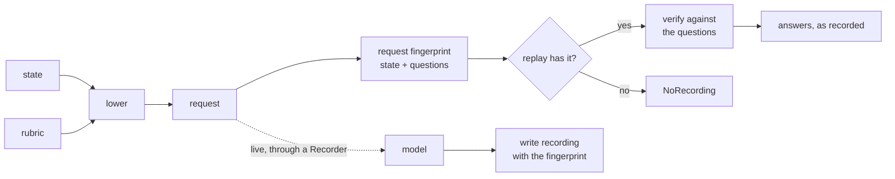

# What a recording is

A recording is one model response to one request, kept as it was received. It is the third kind of `.jud` document: [a rubric](rubric.md) says what the model is asked, [cases](cases.md) say what the right answers are, and a recording says what the model actually answered, on which server, when, and for exactly which request. The specification is [the .jud format](../jud.md#recording); this page is the reasoning.

## The problem a recording solves

Every answer a System One model gives costs a call, and the call is the one part of a decision that cannot be rerun for free. Once the answer is read and acted on, it is gone: the probabilities, the confidence, the request id that would find the call in the server's logs. A month later, when the threshold is questioned or the model version moves, nobody can say what the model said last time, and the only way to find out is to spend the calls again, against a model that may no longer be the same.

A recording keeps the answer. With a directory of them, a run is replayed with no key and no network, in a test or on a laptop; graded again when a label changes; compared with a later model's answers without a second account; and traced to the server's logs by the request id it carries. The calibration loop runs on recordings the same way it runs live, because a replay is a backend like any other.



## What a recording holds

- **`response`**, exactly as received: the model that answered, the answers by question id in the wire's shape, the usage, the request id, and any field the server added. Nothing is normalised, because the point is to keep what the server said.
- **`elapsed_ms`**, the wall-clock time of the call, so a replay can report what a live run would have cost.
- **`fingerprint`**, the identity of the request: the state and the questions, as canonical JSON. It is the key a replay finds the recording by.
- **`rubric`**, the rubric the questions came from, by name or by fingerprint; **`server`**, the base URL that answered; **`recorded_at`**, when. A `jev-latest` alias moves, and the date says which version it could have been.
- **`metadata.name`**, the case the recording answers, or one turn of it as `<case>-turn-<n>`, or the request hash when a recorder keyed it by content alone. It is a name, so the file can be named after it.

```yaml
apiVersion: jud/v1.3
kind: Recording
metadata:
  name: receipt
spec:
  response:
    model: jev-1.13.0
    answers:
      actionable: {type: noul, noul: 0.52}
      desk:
        type: choice
        choice: billing
        probabilities: {account: 0.02, billing: 0.55, none_of_these: 0.4, technical: 0.03}
        confidence: 0.4
    usage: {input_tokens: 410, output_tokens: 38}
    request_id: req_01a1…
  elapsed_ms: 140
  fingerprint: sha256:8afe973c8409a45fc93b67678fa8954351ea4a5291b1ba58a9e6754c289890cd
  rubric: inbox-triage
  server: https://api.typesafe.ai
  recorded_at: "2026-10-04T11:58:00Z"
```

## The fingerprint leaves the model out

The request fingerprint is over the state and the questions, and not the model name. That is deliberate. The model is the thing a comparison varies: the same request answered by one version and by the next, or by the hosted server and by a local one, has the same fingerprint, and each recording says in `response.model`, `server` and `recorded_at` who answered. A replay that must tell two models apart keeps their recordings in two directories.

The fingerprint sees content, not key order: canonical JSON sorts keys. A rubric whose options were reordered produces the same fingerprint and so finds the same recording, although the model saw the options in another order. For a replay that is the right behaviour, since the answer was to the same content; for a comparison of two orderings it is not, and that comparison needs two runs rather than one replay.

## Verified before it is replayed

A recording is not trusted because it is on disk. When a replay finds one, it verifies the recorded response against the questions of the request that found it, exactly as a live response would be verified: an answer for every question, of its primitive, a Choice naming only offered options, a Score whose legend parses to the levels sent. A recording edited by hand, or recorded against a rubric that has since changed, fails naming the question rather than replaying an answer the rubric would refuse.

The replayed response carries the recorded request id, so an answer that looks wrong in a replay can still be found in the server's logs.

A request nobody recorded is an error, never a silent default. A replay directory answers what it holds and refuses the rest, which is how a test notices that a case was added and not yet recorded.

## How recordings are made

Almost always by a program, not by hand. The crate's `Recorder` wraps any backend and writes a recording for every call it forwards, keyed by the request's content, so a test suite records once against the real model and replays forever. The `.jud` form is written by `recording_to_yaml`, and the crate's own `.json` form by `write_recording`; a replay reads both from one directory and finds either by fingerprint. The pattern examples under `examples/` each keep their recordings under `examples/recordings/<example>/`, replay them by default, and record anew only when asked.

A conversation case records one file per turn, `<case>-turn-<n>`, because each turn is its own request with its own fingerprint.

A recording is written by hand in one situation: a test fixture, where the answer is scripted and the point is the shape. Then the fingerprint is the one the request has, which `jud check` prints when it binds the recording to its case, and the response is written in the wire's own shape so that verification passes for the reason a real one would.

## What a recording is not

- **Not a label.** A recording says what the model said; a [case](cases.md) says what it should have said. The two are compared at grading time and never merged. Copying a recorded answer into a case's `expect` is how a test comes to pass by definition.
- **Not a verdict.** A recording holds probabilities, never what the policy made of them. The policy can move after the recording was made, and the recording still grades, because the verdict is derived when it is read.
- **Not a cache.** A cache serves what it has and fetches what it lacks. A replay refuses what it lacks, by design: the test that reaches for a missing recording has found a request the suite never saw.
- **Not evidence of correctness.** A recording that verifies fits the questions; whether the answer was right is the cases' business.

## How recordings are read

By a reviewer, rarely, and mostly for one thing: what did the model say on this case, with what confidence, and when. A directory of recordings beside a cases document is the audit trail of a tuning run.

By a program, through `Replay::open` on a directory, which loads every regular `.json` and `.jud` file that carries a request hash or a fingerprint, skips anything else, and answers requests by fingerprint. Any code written against the `SystemOne` trait runs on a replay unchanged: the calibration example, the pattern examples and the tests all do.

## In the crate

`judgment::jud` (feature `jud`) reads and writes the kind with `parse_recording` and `recording_to_yaml`, into and from `eval::Recording { case, response, elapsed_ms, request_hash, fingerprint, rubric, server, recorded_at }`, whose `case` is the document's `metadata.name`. `Recorder` makes recordings and `Replay` serves them; `eval::canonical::request_fingerprint` is the key; `eval::write_recording` and `read_recording` handle the crate's own `.json` form. [The .jud format](../jud.md#recording) specifies every field, and the thirteen documents under [`examples/recordings/jud_calibration/`](../../examples/recordings/jud_calibration/) are what the calibration example replays.
