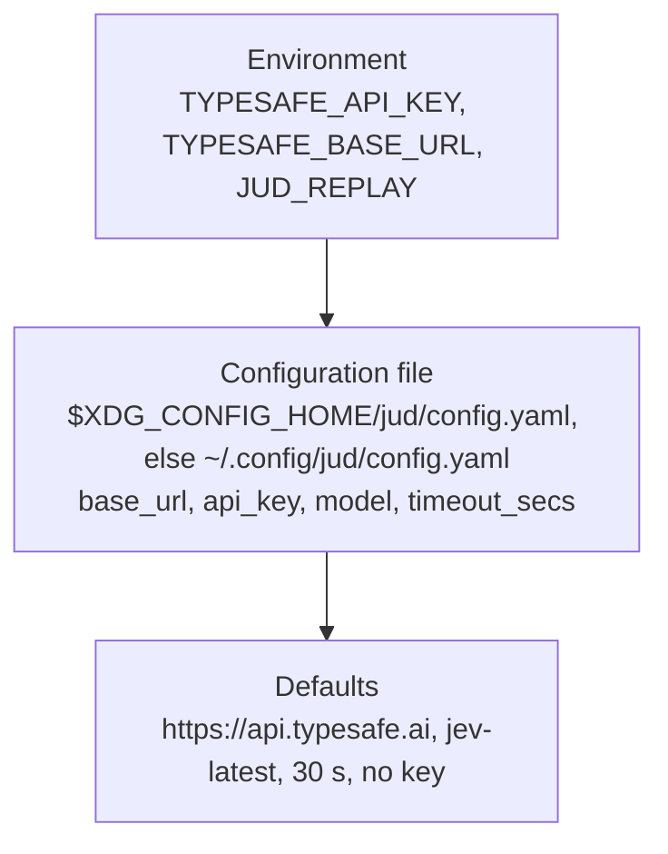

# Configuration

The settings of the `jud` command and of the crate's `Client`, as `src/bin/jud/config.rs` and `src/client.rs` read them. [Configure a backend](../guides/configure-a-backend.md) is the procedure for each server; this page is the facts.

## The `jud` command

### Precedence

Each level overrides the one below it. The environment wins over the file, the file over the defaults.



| Setting | Environment | File field | Default |
|---|---|---|---|
| Base URL | `TYPESAFE_BASE_URL` | `base_url` | `https://api.typesafe.ai` |
| API key | `TYPESAFE_API_KEY` | `api_key` | none; a command that asks a backend with no key is refused with status 2 |
| Model | | `model` | `jev-latest` |
| Timeout per attempt | | `timeout_secs` | `30` |
| Replay directory | `JUD_REPLAY` | | none; the flag `--replay DIR` overrides the variable; [which commands read it](#replay) |

`TYPESAFE_API_KEY` and `TYPESAFE_BASE_URL` set to an empty or blank value count as unset. `JUD_REPLAY` set to an empty or blank value does not: [Replay](#replay) says what happens. No environment variable names the model for the command; the examples under `examples/` read `TYPESAFE_MODEL` for their `--live` runs, the command does not ([beads issue `judgment-rxl`](../project/contributing.md#tracking-work)).

### Variables jud does not read

An unset base URL means the hosted API, so a misspelt variable (`JUD_BASE_URL` for `TYPESAFE_BASE_URL`) would send paid calls there without a word, and `TYPESAFE_MODEL`, which the examples read, would leave the command on the configured model, `jev-latest` by default. Every `TYPESAFE_*` or `JUD_*` variable set in the environment that is none of the three above is therefore named: before a command asks a server, and in `jud record --dry-run`, which is where a run's target is checked, one line on stderr per variable, saying what the command reads instead and which model and server it is asking; and in `jud config`, as `ignored_environment`. Only names are shown, never values, since a misspelt key variable holds a key. Under a replay nothing is asked, so nothing is named.

```text
jud: JUD_BASE_URL is set but jud does not read it (it reads TYPESAFE_BASE_URL, TYPESAFE_API_KEY and JUD_REPLAY, and the model from `model` in /home/me/.config/jud/config.yaml); asking jev-latest at https://api.typesafe.ai, the base URL from default
```

`jud record` and `jud eval` also name the model and the server before their first call, whatever is set ([What `jud record` prints](cli.md#what-it-prints)).

### The file

`$XDG_CONFIG_HOME/jud/config.yaml` when `XDG_CONFIG_HOME` is set and not empty, else `$HOME/.config/jud/config.yaml`. Every field is optional; a field the file does not define is refused, and a file that is not valid YAML is a usage error (status 2). An empty file is the same as no file.

<!-- file: examples/jud/config-reference.yaml -->
```yaml
# ~/.config/jud/config.yaml: every field optional
base_url: https://api.typesafe.ai
model: jev-latest
timeout_secs: 30
# api_key: ...   # prefer TYPESAFE_API_KEY, which no file on disk holds
```

### `jud config`

Prints the resolved backend and where each value came from, as JSON on stdout. The key is reported as `environment`, `config_file` or `missing` and never printed. With no variables set and no file:

<!-- transcript: env -u TYPESAFE_API_KEY -u TYPESAFE_BASE_URL XDG_CONFIG_HOME=/nonexistent jud config -->
```json
{
  "config_file": "/nonexistent/jud/config.yaml",
  "config_file_present": false,
  "base_url": "https://api.typesafe.ai",
  "base_url_from": "default",
  "model": "jev-latest",
  "model_from": "default",
  "timeout_secs": 30,
  "api_key": "missing"
}
```

`*_from` is `environment`, `config_file` or `default`. `ignored_environment`, the [variables jud does not read](#variables-jud-does-not-read) that are set, is there only when there are some.

### Replay

With `--replay DIR` or `JUD_REPLAY=DIR`, a command answers from the recordings under the directory and consults no key, no file and no network. Commands that take the flag take it after the subcommand, so each command's `--replay` is its own ([The jud command line](cli.md)).

| Command | `--replay DIR` | `JUD_REPLAY` |
|---|---|---|
| `jud RUBRIC` | optional | read |
| `jud eval` | optional; without one the configured backend answers | read |
| `jud tune` | required | read, and satisfies the requirement |
| `jud record` | none; the flag is refused with status 2 | never read: it always asks the configured backend |
| `jud config`, `jud check`, `jud lower`, `jud completion` | none | not read |

The flag overrides the variable. A `JUD_REPLAY` that is set to an empty value is refused by every command, `jud record` and `jud config` included, with status 2 and the message `a value is required for '--replay <DIR>'`; unset it instead. A blank value, spaces only, is taken as a directory name, and a command that reads it refuses it with status 2.

The directory is read as the crate's `Replay` backend reads it: every regular `.json` and `.jud` file in it, in name order. A file that does not read as a recording refuses the whole directory with status 2. A recording that carries neither a request hash nor a fingerprint is skipped, and so are links, subdirectories and files with another extension. A request is found by its fingerprint, then by its hash, never by a file name. When two files record one request, the later by name answers; `jud record` and `jud tune` warn about that.

A request nobody recorded is a backend failure (status 1); a directory that does not exist is a usage error (status 2). [Record, replay and test](../guides/record-replay-and-test.md) is the procedure, and [The jud command line](cli.md#the-case-commands) says what each command does with the recordings.

## The crate's client

`Client::from_env()` and `Client::builder()` read:

| Setting | Source | Default |
|---|---|---|
| API key | `TYPESAFE_API_KEY`, or `ClientBuilder::api_key` | none; `Error::MissingApiKey` when the client is built |
| Base URL | `ClientBuilder::base_url` | `https://api.typesafe.ai` |
| Model | the `model` argument of `SystemOne::answer`, or `ClientBuilder::model` for `Client::system_one` | `jev-latest` |
| Timeout per attempt | `ClientBuilder::timeout`, or `CallOptions::timeout` for one call | 10 s |
| Retries | `ClientBuilder::retry_policy`, or `CallOptions` for one call | `RetryPolicy::default()`: [The crate](crate.md#defaults) |

The crate's client reads no base URL from the environment; the `jud` command and the examples do, and pass it to the builder. The two timeouts differ on purpose: a library call is usually one of many on a request path and fails fast at 10 s; a command-line run has a person waiting and a local model that may be loading, so it waits 30 s.

The constants are public: `judgment::client::{API_KEY_ENV, DEFAULT_BASE_URL, DEFAULT_MODEL, DEFAULT_TIMEOUT, REQUEST_ID_HEADER}` ([docs.rs](https://docs.rs/judgment/latest/judgment/client/index.html)).
