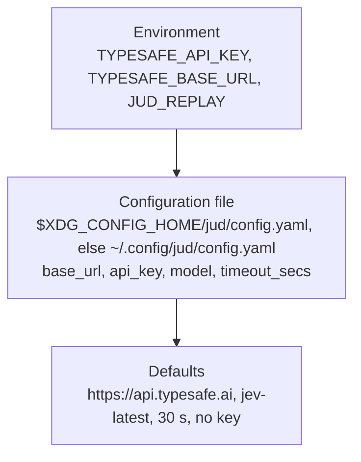

# Configuration

The settings of the `jud` command and of the crate's `Client`, as `src/bin/jud/config.rs` and `src/client.rs` read them. [Configure a backend](../guides/configure-a-backend.md) is the procedure for each server; this page is the facts.

## The `jud` command

### Precedence

Each level overrides the one below it. The environment wins over the file, the file over the defaults.



| Setting | Environment | File field | Default |
|---|---|---|---|
| Base URL | `TYPESAFE_BASE_URL` | `base_url` | `https://api.typesafe.ai` |
| API key | `TYPESAFE_API_KEY` | `api_key` | none; a run with no key is refused with status 2 |
| Model | | `model` | `jev-latest` |
| Timeout per attempt | | `timeout_secs` | `30` |
| Replay directory | `JUD_REPLAY` | | none; the flag `--replay DIR` overrides the variable |

An environment variable that is set to an empty or blank value counts as unset. No environment variable names the model for the command; the examples under `examples/` read `TYPESAFE_MODEL` for their `--live` runs, the command does not ([beads issue `judgment-rxl`](../project/contributing.md#tracking-work)).

### The file

`$XDG_CONFIG_HOME/jud/config.yaml` when `XDG_CONFIG_HOME` is set and not empty, else `$HOME/.config/jud/config.yaml`. Every field is optional; a field the file does not define is refused, and a file that is not valid YAML is a usage error (status 2). An empty file is the same as no file.

<!-- file: examples/jud/config-reference.yaml -->
```yaml
# ~/.config/jud/config.yaml: every field optional
base_url: https://api.typesafe.ai
model: jev-latest
timeout_secs: 30
# api_key: ...   # prefer TYPESAFE_API_KEY, which no file on disk holds
```

### `jud config`

Prints the resolved backend and where each value came from, as JSON on stdout. The key is reported as `environment`, `config_file` or `missing` and never printed. With no variables set and no file:

<!-- transcript: env -u TYPESAFE_API_KEY -u TYPESAFE_BASE_URL XDG_CONFIG_HOME=/nonexistent jud config -->
```json
{
  "config_file": "/nonexistent/jud/config.yaml",
  "config_file_present": false,
  "base_url": "https://api.typesafe.ai",
  "base_url_from": "default",
  "model": "jev-latest",
  "model_from": "default",
  "timeout_secs": 30,
  "api_key": "missing"
}
```

`*_from` is `environment`, `config_file` or `default`.

### Replay

With `--replay DIR` or `JUD_REPLAY=DIR`, the run answers from the recordings under the directory and consults no key, no file and no network. The directory is read as the crate's `Replay` backend reads it: every regular `.json` and `.jud` file that carries a request hash or a fingerprint. A state nobody recorded is a backend failure (status 1); a directory that does not exist is a usage error (status 2). [Record, replay and test](../guides/record-replay-and-test.md).

## The crate's client

`Client::from_env()` and `Client::builder()` read:

| Setting | Source | Default |
|---|---|---|
| API key | `TYPESAFE_API_KEY`, or `ClientBuilder::api_key` | none; `Error::MissingApiKey` when the client is built |
| Base URL | `ClientBuilder::base_url` | `https://api.typesafe.ai` |
| Model | the `model` argument of `SystemOne::answer`, or `ClientBuilder::model` for `Client::system_one` | `jev-latest` |
| Timeout per attempt | `ClientBuilder::timeout`, or `CallOptions::timeout` for one call | 10 s |
| Retries | `ClientBuilder::retry_policy`, or `CallOptions` for one call | `RetryPolicy::default()`: [The crate](crate.md#defaults) |

The crate's client reads no base URL from the environment; the `jud` command and the examples do, and pass it to the builder. The two timeouts differ on purpose: a library call is usually one of many on a request path and fails fast at 10 s; a command-line run has a person waiting and a local model that may be loading, so it waits 30 s.

The constants are public: `judgment::client::{API_KEY_ENV, DEFAULT_BASE_URL, DEFAULT_MODEL, DEFAULT_TIMEOUT, REQUEST_ID_HEADER}` ([docs.rs](https://docs.rs/judgment/latest/judgment/client/index.html)).
