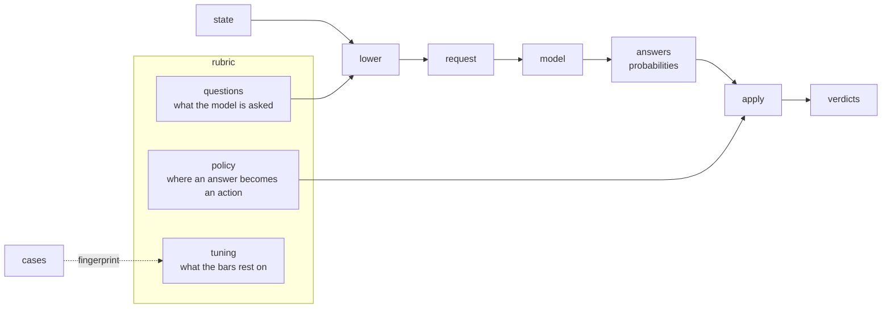

# What a rubric is

A rubric is a decision written down so that a person can review it and a program can run it. It holds the questions a model is asked about a state, and the thresholds at which the model's answers become actions. It is the first of the three kinds of `.jud` document, and the one the other two exist for: [cases](jud.md#cases) are what a rubric is graded on, [recordings](jud.md#recording) are what a model answered when it was. This page says why a decision takes this shape and how to write one. [The .jud format](jud.md) is the specification; this page is the reasoning behind it.

## The word

The word comes from grading. A rubric is the sheet a grader holds: the questions to answer about a piece of work, and the scale that turns each answer into a mark. Two graders with the same rubric give the same mark for the same work, and a third person can read the rubric and see why.

A System One model is graded the same way. It is not asked to decide; it is asked narrow, typed questions and it answers each with a probability. The application decides, by comparing the probability to a bar. The questions are the rubric's first half. The bars are its second. Neither is a decision on its own, and together they are the whole of one.

## The problem a rubric solves

A request to the model is simple: a state, a model name and a map of typed questions. What is hard is keeping everything around it in one place.

In a codebase without a rubric, the questions live in Rust, built with the request. The threshold a probability is acted on at lives in a configuration file, or in a constant with a name like `URGENCY_CUTOFF`. The labelled examples the threshold was tuned on live in a notebook that no longer runs. The answers the model gave last month live nowhere. When the model version moves, the person on call cannot say which of the four changed, or whether the threshold still holds, because the four were never written beside each other.

A rubric puts the first two in one file, and names the other two by content. The questions and the policy are read together, so a reviewer sees what is asked and where the line is drawn in one screen. The `tuning` block says which cases the line was drawn on, by fingerprint, and which model answered them. Nothing about the decision is left in someone's head.



The model sees the questions. It never sees the policy. That line through the middle of the file is the most important thing about it, and the rest of this page comes back to it.

## The three parts

A rubric document is a manifest: `apiVersion: jud/v1.3`, `kind: Rubric`, a `metadata` block with the rubric's `name` (and a `version` or a `description` when the author keeps one), and a `spec` block that holds the three parts this section quotes: `questions`, `policy` and `tuning`. The envelope identifies the file; the three parts are the decision.

### Questions: what the model is asked

The `questions` map is exactly what the wire carries, in the order the model sees it. There is no translation layer: a question in a rubric is the same object a request builder would send, so the API's documentation is the reference for every field, and the reader applies the same checks the builder applies before sending. A Choice with one option, a Score with eleven levels or a Noul that describes no outcome is refused when the file is read, not when the request fails.

Three primitives cover what a model is asked, and each answers with a number a bar can be set against.

| Primitive | Asks | Answers with |
|---|---|---|
| Noul | A yes-or-no question | The probability of yes |
| Choice | One option among those offered | The chosen option, a probability per option, and a confidence |
| Score | A position on a scale of levels | A weighted position, the nearest level, and a confidence |

The id of a question is the key its answer comes back under. The model never sees it, which is why `actionable` and `desk` are fine ids and need no prose. The question's `instructions` and `criteria` are what the model reads, and they do the work: each says what one outcome means, so that a yes is a yes about the same thing every time.

```yaml
questions:
  actionable:
    type: noul
    instructions: Does `message` ask for something to be done, or report something that is broken?
    criteria:
      true: a request, a question that needs an answer, a report of a fault
      false: thanks, an acknowledgement, small talk, an automated receipt
  desk:
    type: choice
    instructions: Which desk should take `message`?
    criteria:
      billing: Invoices, payments, refunds, subscription changes
      technical: Errors, outages, anything about using the product
      account: Sign-in, passwords, personal details, closing an account
      none_of_these: Not clearly any desk, or not a request at all
  tone:
    type: score
    instructions: How upset is the writer of `message`?
    criteria: [calm, annoyed, angry]
```

The order is part of the meaning. The model sees the questions in the order written and a Choice's options in the order written, and a reader preserves both, because a model answers a list differently from a set.

### Policy: where an answer becomes an action

The `policy` map holds one gate per question, and a gate says where that question's answer is acted on. For a Noul, a `threshold` on the probability of yes. For a Choice or a Score, a `confidence` bar below which the answer is deferred, with a `fallback` to act on instead, or several `bands`, each naming a verdict, so that an answer at high confidence routes, at middling confidence asks for confirmation and below that waits for a person. A Score can add `level_at_least`, the level the nearest answer must reach.

```yaml
policy:
  actionable:
    threshold: 0.55
    note: best F1 on the labelled cases; 0.5 lets the automated receipt through
  desk:
    confidence: 0.45
    fallback: none_of_these
    note: lowest bar at 95% accuracy; covers 6 of 7 labelled cases
  tone:
    confidence: 0.3
```

A gate is read against its question, and refused when it does not fit: a `threshold` on a Choice, a `fallback` naming an option the question does not offer, a `level_at_least` naming a level the scale does not have. The policy cannot say something the questions make impossible.

Reading a response through the policy gives one verdict per question asked: a yes or a no with its probability; an option with its confidence and band, or a deferral with the fallback and the option the model would have chosen; a level with its index, its confidence and whether it reached the bar. A verdict is derived, never stored. A rubric says how to read an answer; it never records what the answer should have been made to say.

### Tuning: what the bars rest on

A threshold of 0.55 is a claim. The `tuning` block says what it rests on: the cases document the bar was tuned against, named by fingerprint so that an edited case set is visibly a different one; the versioned model that answered them, because a bar tuned on one version does not carry to the next; the server, because two servers speaking the same wire answer differently; and the time. It accepts any further field, so the accuracy and coverage at the chosen bar, or a link to the run, can sit beside the bar they justify.

```yaml
tuning:
  cases: sha256:d752d8066b2067b299512b2d3153ca0aeaed0284589dc5624039aed1abd895b6
  model: jev-1.13.0
  server: https://api.typesafe.ai
  tuned_at: 2026-10-04T12:00:00Z
  labelled: 7
```

A rubric written by hand has no `tuning` block. That absence is information: the bars are guesses, and the next person knows it.

## What a rubric is not

The shape is as much about what is left out as what is in.

- **Not a prompt.** The model receives typed questions with criteria, not free text asking it to decide. A question is narrow and atomic: one thing, answered with one probability. "Which desk, and is it urgent, and should we refund?" is three questions, and a rubric holds them as three.
- **Not the policy's input.** The policy is never sent. The model answers the questions as if no threshold existed, so the probabilities it returns are about the state, not about what the application will do with them. A bar can move without a single answer changing, which is what makes a bar tunable.
- **Not deterministic logic.** Whether an account is on an enterprise plan, whether a ticket is older than a week, whether a refund is above the limit: these are facts the application already has, and it decides them in code. A rubric asks the model only what the application cannot compute. The one test the format makes on a state is whether a path is present, used to leave a question out when there is nothing to ask it about.
- **Not a record of outcomes.** Verdicts are derived when a response is read. A rubric never says what the model should have been made to answer; cases carry labels, and recordings carry what was actually said.

## Two fingerprints, and why

A rubric's fingerprint is the fingerprint of its `questions` map alone, computed over canonical JSON so that any implementation gets the same bytes. It is the exact identity of what the model can be asked, unchanged by the name, the description, a label or an annotation, a comment, or the policy. A recording names the rubric it answers by it, and a cases document names the rubric its labels are for by it, when the name is not enough.

That makes it deliberately not an integrity check of the decision. A rubric whose gate moved from `confidence: 0.45` to `0.30` has the same fingerprint, and an application that pins only it would accept a rewritten policy without noticing. So a rubric has a second fingerprint, the policy fingerprint, computed over the `policy` map alone. An application that must notice a change to what it does with an answer pins both. `tuning` is provenance and part of neither.

| Changed | Questions' fingerprint | Policy fingerprint |
|---|---|---|
| A question's instructions, an option, a level | moves | unchanged |
| A threshold, a bar, a band, a fallback, a gate's `note` | unchanged | moves |
| The name, the description, the labels and annotations, the `tuning` block | unchanged | unchanged |

One thing neither sees: canonical JSON sorts keys, so reordering the questions or a Choice's options changes what the model sees without moving either fingerprint. That is a review's job, and one reason the file is meant to be read. In the crate, the two are `Rubric::fingerprint` and `Rubric::policy_fingerprint`.

## How a rubric is read

By a reviewer, in one screen. The questions say what the model is asked, in the words the model sees. The gates beneath them say where the line is. The `note` on each gate says why it is there. The `tuning` block says what it was measured on. A pull request that moves a threshold shows the moved number and the fingerprint of the cases it was re-tuned on, or shows a number with nothing behind it, which a reviewer can see too.

By a program, in four steps. `Rubric::parse` reads the file and refuses what a request builder would refuse. `Rubric::lower` builds the request for one state: the questions whose `when` holds, in the rubric's order, with per-request options in place, through the same checks a request written in code goes through. Any `SystemOne` backend answers it: the client, a `Fake` in a test, a `Replay` of recordings. `Rubric::apply` reads the response through the policy into verdicts. The code that does this names no question and no threshold; both live in the file.

```rust
let rubric = Rubric::parse(&std::fs::read_to_string("triage.jud")?)?;
let questions = rubric.lower(&state, &Supplied::default())?;
let response = backend.answer(&state, "jev-latest", &questions).await?;
let verdicts = rubric.apply(&questions, &response)?;
```

The reader is strict on purpose. It reads exactly one `apiVersion` and refuses a field it does not know, so a document for a later apiVersion is refused whole rather than half-read. It refuses what hides text from the person reading the file: a merge key, a tag the YAML core schema does not define. It refuses a name that is not a [name](jud.md#names), so a name never reaches a file system as a path. What a reviewer approved is what the program runs.

## How a rubric is written

A rubric is written twice: once by hand, to state the questions, and once by the loop, to put numbers on the bars.

1. **Write the questions.** One per thing the application needs to know and cannot compute. Give each outcome a criterion in plain words. Put a `none_of_these` option on a Choice when the state might fit none, so the model has somewhere to put its doubt other than the wrong desk.
2. **Guess the bars, and say so.** A `threshold: 0.5` with no `tuning` block is honest. A `threshold: 0.55` with no `tuning` block looks measured and is not.
3. **Label cases.** A handful of states with the answer a person would give, as a cases document that names the rubric. The labels are what the bars are tuned on, so the cases are the examples that matter: the obvious ones, and the ones that were argued about.
4. **Run the loop.** Answer every case, grade every answer against its label, sweep each bar and read off the one with the best F1 or the lowest bar that keeps the accuracy wanted. The crate's `jud_calibration` example runs this end to end over the documents in `examples/jud/`.
5. **Write it back.** The tuned gates go into `policy`, the cases' fingerprint, the model and the server into `tuning`. The next person to open the file sees what the numbers rest on.

When the model version moves, run step 4 again. The questions do not change, so their fingerprint does not; the bars may, and the policy fingerprint shows it; the `tuning` block names the new model. The three things that could have drifted are three fields in one file, each with a fingerprint or a name.

## Writing questions that hold up

A rubric is only as good as its questions, and the failure modes repeat.

- **One question, one thing.** A model answers a compound question with one probability about nothing in particular. Split it.
- **The criteria carry the meaning.** `Does the message convey urgency?` reads differently to every grader; `true: a deadline, a service down, a threat to cancel` reads the same to all of them, and to the model.
- **Name the state.** Instructions that say `message` and criteria that say what is in it tell the model where to look. The state is JSON, and the model sees all of it.
- **Offer a way out.** A Choice with no option for "none of these" forces a wrong answer at high confidence. A Score with no neutral level does the same.
- **Ask only when there is something to ask.** A question about open tickets costs tokens and returns noise when no ticket is open. `when: customer.open_tickets` leaves it out of the request.
- **Keep the decision out.** The threshold belongs in the policy, never in the instructions. A question that says "answer yes only if you are quite sure" has moved the bar into the model, where it cannot be tuned.

## In the crate

`judgment::jud` (feature `jud`, off by default) implements the rubric kind as `Rubric`: `parse`, `to_yaml`, `fingerprint`, `policy_fingerprint`, `lower`, `apply` and `gate`. [The .jud format](jud.md) specifies every field and reading rule; [decision 0014](decisions/0014-a-file-format-for-rubrics-cases-and-recordings.md) says why the three kinds share one format, and [decision 0018](decisions/0018-jud-1-3-takes-the-manifest-envelope.md) why the envelope is a manifest's and the reader reads one apiVersion. The two records it supersedes hold reasoning that still stands: [decision 0016](decisions/0016-jud-takes-minor-versions.md) why a request may depend on the state, and [decision 0017](decisions/0017-jud-1-2-refuses-what-a-reviewer-cannot-see.md) why the reader refuses what a reviewer cannot see. The README's second and third examples run a rubric against a `Fake` and against the hosted API; [`examples/jud/triage.jud`](../examples/jud/triage.jud) is the rubric this page quotes, with the cases it was tuned on beside it.
